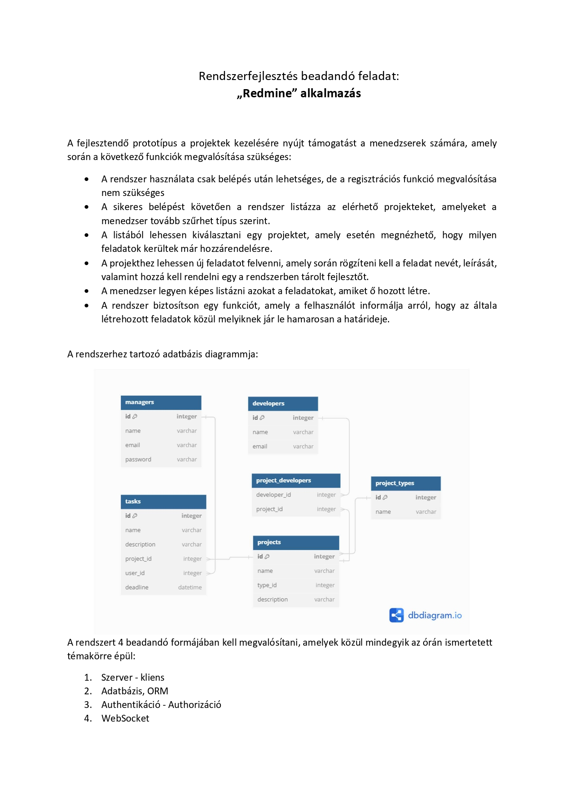

<<<<<<< HEAD

=======
<!DOCTYPE html>
<html lang="en">
<head>
<meta charset="UTF-8">
<meta name="viewport" content="width=device-width, initial-scale=1.0">
</head>
<body>

>>>>>>> f40c16bcc34db5fa1512c0dd9d26272b41377b29
